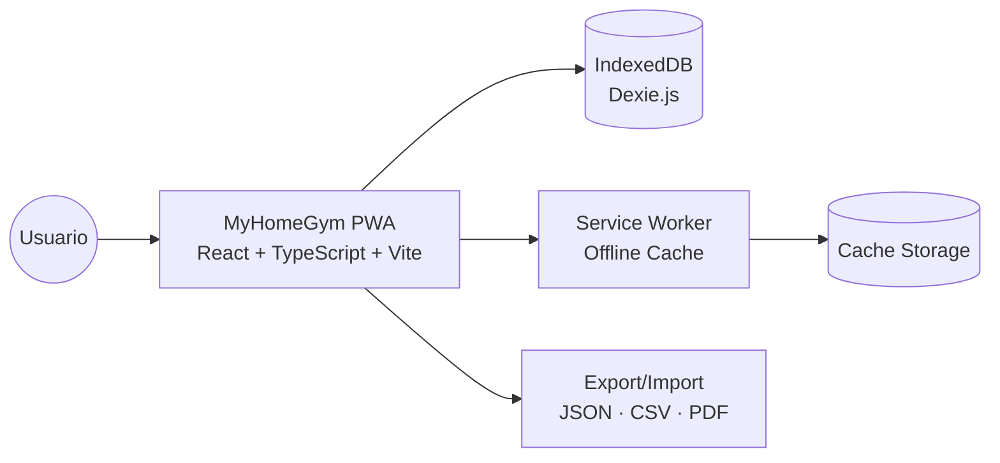

# MyHomeGym

🌐 Idioma: [English](./README.md) | **Español**


Una PWA **Local-First** de alto rendimiento diseñada para seguimiento de entrenamiento orientado a hipertrofia, con registro rápido de series/repeticiones/carga y analítica accionable del progreso físico. La arquitectura está pensada para minimizar fricción durante la sesión: la interfaz responde en tiempo real y el flujo de trabajo prioriza velocidad de captura y claridad de métricas.

Su diferencial es un enfoque **privacy-first** y **offline-ready**: no depende de nube para el flujo principal, mantiene los datos en el dispositivo y garantiza continuidad de uso incluso sin conexión. MyHomeGym materializa requisitos no funcionales críticos (disponibilidad, baja latencia, mantenibilidad) mediante Service Workers + IndexedDB y una arquitectura por capas con repositorios desacoplados.

---

## Tabla de contenidos

- [1. Características principales](#1-características-principales)
- [2. Mapa de contexto (arquitectura de alto nivel)](#2-mapa-de-contexto-arquitectura-de-alto-nivel)
- [3. Decisiones técnicas destacadas](#3-decisiones-técnicas-destacadas)
- [4. ⚡ Why Local-First?](#4--why-local-first)
- [5. Vista de implementación / instalación](#5-vista-de-implementación--instalación)
- [6. Estructura del proyecto](#6-estructura-del-proyecto)
- [7. Modelo de datos local](#7-modelo-de-datos-local)
- [8. Rutas principales](#8-rutas-principales)
- [9. Scripts disponibles](#9-scripts-disponibles)
- [10. Calidad: lint, build y testing](#10-calidad-lint-build-y-testing)
- [11. Demo visual (placeholders)](#11-demo-visual-placeholders)
- [12. Exportación, backup y recuperación](#12-exportación-backup-y-recuperación)
- [13. Roadmap](#13-roadmap)
- [14. Documentación extendida](#14-documentación-extendida)
- [15. Contribución](#15-contribución)

---

## 1. Características principales

### 🏋️‍♂️ Gestión de entrenamientos

- Registro de entrenamientos por rutina y en modo libre.
- Control detallado por ejercicio, series, repeticiones, carga y observaciones.
- Temporizador de descanso con feedback (audio/háptica) desacoplado por eventos.
- Flujo preparado para variables de intensidad percibida (RPE) y progresión semanal.

### 📊 Analíticas y progreso

- Dashboard con resumen de actividad reciente y consistencia.
- Gráficos de evolución (peso corporal, volumen, tendencias históricas).
- Mapa de calor y diagrama muscular interactivo para distribución de carga.
- Detección y seguimiento de PRs + métricas de RM estimada/indicadores de rendimiento.

### ⚙️ Arquitectura local

- Operación sin login en nube para flujo core.
- Persistencia local robusta con IndexedDB (Dexie).
- Exportación e importación de datos en formatos portables (JSON/CSV).
- Generación de PDF para resumen y trazabilidad personal.

---

## 2. Mapa de contexto (arquitectura de alto nivel)



---

## 3. Decisiones técnicas destacadas

- **Frontend (React + TypeScript + Vite):** entrega rápida de UI reactiva, seguridad de tipos en todo el ciclo de desarrollo y build optimizado para rendimiento.
- **Persistencia (Dexie.js sobre IndexedDB):** elección alineada con patrón **Local-First** para disponibilidad offline, baja latencia y control de datos por parte del usuario.
- **UI (Tailwind CSS):** acelera diseño consistente y mantenible con un sistema utilitario explícito y fácilmente refactorizable.
- **PWA (Service Workers):** instalabilidad en móvil/escritorio, cache de activos y continuidad operativa sin conexión.
- **Arquitectura por capas + repositorios:** desacopla UI de infraestructura, mejora testabilidad y reduce riesgo de deuda técnica.

---

## 4. ⚡ Why Local-First?

La ausencia de backend obligatorio para el flujo principal es una decisión de ingeniería deliberada: reduce complejidad operativa, elimina costos de infraestructura y minimiza superficies de fallo externas. En la práctica, las operaciones críticas ocurren en el dispositivo, logrando latencia percibida casi instantánea y mayor resiliencia ante conectividad inestable.

Este enfoque también fortalece privacidad y soberanía de datos: el usuario conserva control de su historial y decide explícitamente cuándo exportar o compartir información.

---

## 5. Vista de implementación / instalación

### Requisitos previos

- Node.js 20+
- npm 10+

### Setup para developers

```bash
git clone https://github.com/<tu-usuario>/Proyecto-MyHomeGym.git
cd Proyecto-MyHomeGym
npm install
npm run dev
```

Antes de ejecutar la app, configura variables de Firebase:

```bash
cp .env.example .env.local
```

Después completa todos los valores `VITE_FIREBASE_*` en `.env.local`.

Añade también tu API key de RapidAPI para ExerciseDB:

- `VITE_EXERCISEDB_API_KEY`

### Despliegue en GitHub Pages (Firebase)

Añade las mismas variables como **Repository Secrets** en GitHub:

- `VITE_FIREBASE_API_KEY`
- `VITE_FIREBASE_AUTH_DOMAIN`
- `VITE_FIREBASE_PROJECT_ID`
- `VITE_FIREBASE_STORAGE_BUCKET`
- `VITE_FIREBASE_MESSAGING_SENDER_ID`
- `VITE_FIREBASE_APP_ID`
- `VITE_EXERCISEDB_API_KEY`

### Reglas de Firestore (obligatorias para sincronización)

Si las reglas de Firestore bloquean todo, el login funciona pero la sincronización cloud falla.

1. Abre Firebase Console → Firestore Database → Rules.
2. Pega el contenido de `firestore.rules`.
3. Pulsa Publish.

Regla mínima segura para esta app:

```txt
rules_version = '2';
service cloud.firestore {
    match /databases/{database}/documents {
        match /users/{userId}/{document=**} {
            allow read, write: if request.auth != null && request.auth.uid == userId;
        }
    }
}
```

La app estará disponible en la URL de Vite (por defecto, `http://localhost:5173`).

### Validación técnica local

```bash
npm run lint
npm run test
npm run build
```

---

## 6. Estructura del proyecto

```text
src/
├─ components/      # Componentes reutilizables de UI
├─ hooks/           # Hooks de aplicación y lógica de interacción
├─ pages/           # Pantallas principales por ruta
├─ repositories/    # Acceso a datos por dominio (sin DB directa en UI)
├─ lib/             # Infraestructura: DB, PWA, backup/export, eventos
├─ stores/          # Estado global de interfaz
├─ utils/           # Funciones puras y cálculos
└─ workers/         # Procesamiento asíncrono en background
```

Principio de mantenibilidad: la UI no conversa directamente con la base de datos; toda lectura/escritura pasa por repositorios.

---

## 7. Modelo de datos local

Base de datos: `gym_offline_db`.

Entidades funcionales principales:

- `userProfile`
- `ejerciciosCatalogo`
- `rutinas`
- `rutinaEjercicios`
- `entrenamientosRegistrados`
- `ejerciciosRealizados`
- `medidasCorporalesHistorico`
- `prs`

---

## 8. Rutas principales

- `/` → Dashboard
- `/entrenar` → Entrenamiento
- `/rutinas` → Gestión de rutinas
- `/catalogo` → Catálogo de ejercicios
- `/progreso` → Analíticas y métricas
- `/perfil` → Perfil y preferencias
- `/configuracion` → Backup, restore, PDF, mantenimiento

---

## 9. Scripts disponibles

- `npm run dev`: servidor de desarrollo
- `npm run build`: compilación TypeScript + build de producción
- `npm run preview`: preview del build
- `npm run lint`: análisis estático con ESLint
- `npm run test`: pruebas con Vitest
- `npm run test:ui`: interfaz visual de Vitest

---

## 10. Calidad: lint, build y testing

Checklist mínimo antes de abrir PR:

- Lint sin errores (`npm run lint`)
- Pruebas relevantes pasando (`npm run test`)
- Build de producción exitoso (`npm run build`)

Estrategia recomendada: priorizar pruebas de lógica pura, hooks críticos de flujo de entrenamiento y componentes de alto impacto en UX.

---

## 11. Demo visual (placeholders)


> Sustituye estos enlaces por GIFs/capturas reales para aumentar impacto de portfolio.

---

## 12. Exportación, backup y recuperación

- Exportación local de datos (JSON/CSV).
- Importación de backups para continuidad y migración.
- Generación de PDF para reporting personal.
- Recomendación operativa: exportar backup antes de cambios de versión o pruebas de datos.

---

## 13. Roadmap

- Sincronización cloud **opcional** con estrategia conflict-safe.
- Sistema de gamificación (streaks avanzados, hitos y retos).
- Mayor cobertura de pruebas end-to-end en flujos críticos.
- Auditoría integral de accesibilidad y optimización de performance.

---

## 14. Documentación extendida

| Documento                                                                  | Descripción                              |
| -------------------------------------------------------------------------- | ---------------------------------------- |
| 📐 [Arquitectura y Decisiones de Diseño](./docs/ARCHITECTURE.md)            | Vistas 4+1, ADRs y justificación técnica |
| 🛠 [Guía de Configuración y Dependencias](./docs/SETUP_AND_DEPENDENCIES.md) | Setup del entorno y stack base           |
| 📅 [Plan Maestro](./docs/MASTER_PLAN.md)                                    | Plan de evolución por fases              |
| 🧭 [Orden de Implementación](./docs/IMPLEMENTATION_ORDER.md)                | Secuencia sugerida de desarrollo         |
| 🎞 [Plan de expansión ExerciseDB](./docs/EXERCISEDB_EXPANSION.md)            | Escalado de catálogo y mapeos ES→EN      |

---

## 15. Contribución

Consulta [CONTRIBUTING.md](./CONTRIBUTING.md) para estándares de arquitectura, política de deuda técnica, checklist de PR y lineamientos de testing.

Regla de oro: cambios pequeños, tipados, validados y documentados.
