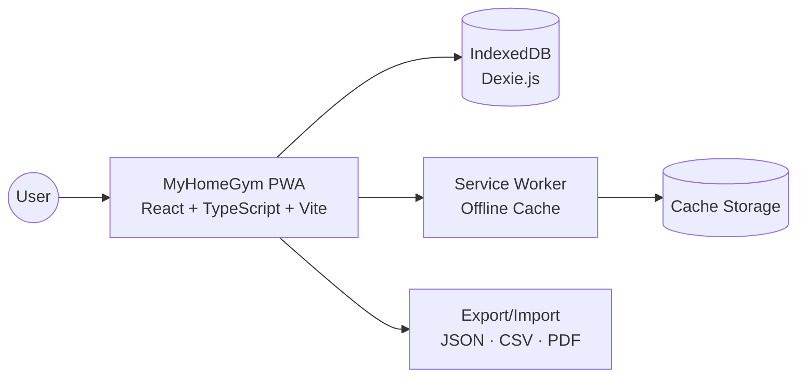

# MyHomeGym

🌐 Language: **English** | [Español](./README.es.md)


A high-performance **Local-First** PWA designed for hypertrophy-oriented training tracking, with fast logging of sets/reps/load and actionable progress analytics. The architecture is built to minimize in-session friction: the interface responds instantly and the workflow prioritizes capture speed and metric clarity.

Its key differentiator is a **privacy-first**, **offline-ready** approach: it does not depend on cloud services for core operation, keeps data on-device, and ensures continuity even without internet access. MyHomeGym operationalizes critical non-functional requirements (availability, low latency, maintainability) through Service Workers + IndexedDB and a layered architecture with decoupled repositories.

---

## Table of contents

- [MyHomeGym](#myhomegym)
  - [Table of contents](#table-of-contents)
  - [1. Key features](#1-key-features)
    - [🏋️‍♂️ Training management](#️️-training-management)
    - [📊 Analytics and progress](#-analytics-and-progress)
    - [⚙️ Local architecture](#️-local-architecture)
  - [2. Context map (high-level architecture)](#2-context-map-high-level-architecture)
  - [3. Key technical decisions](#3-key-technical-decisions)
  - [4. ⚡ Why Local-First?](#4--why-local-first)
  - [5. Setup / installation view](#5-setup--installation-view)
    - [Prerequisites](#prerequisites)
    - [Developer setup](#developer-setup)
    - [Local technical validation](#local-technical-validation)
  - [6. Project structure](#6-project-structure)
  - [7. Local data model](#7-local-data-model)
  - [8. Main routes](#8-main-routes)
  - [9. Available scripts](#9-available-scripts)
  - [10. Quality: lint, build, and testing](#10-quality-lint-build-and-testing)
  - [11. Visual demo placeholders](#11-visual-demo-placeholders)
  - [12. Export, backup, and restore](#12-export-backup-and-restore)
  - [13. Roadmap](#13-roadmap)
  - [14. Extended documentation](#14-extended-documentation)
  - [15. Contributing](#15-contributing)

---

## 1. Key features

### 🏋️‍♂️ Training management

- Routine-based and free-mode workout logging.
- Detailed control per exercise, set, reps, load, and notes.
- Rest timer with event-driven feedback (audio/haptics), decoupled through pub/sub.
- Flow prepared for perceived exertion variables (RPE) and weekly progression.

### 📊 Analytics and progress

- Dashboard with recent activity and consistency insights.
- Evolution charts (body weight, volume, historical trends).
- Muscle heatmap and interactive body diagram for load distribution.
- PR detection and tracking + estimated 1RM/performance indicators.

### ⚙️ Local architecture

- No cloud login required for core workflows.
- Robust local persistence with IndexedDB (Dexie).
- Portable data export/import (JSON/CSV).
- PDF generation for personal summaries and reporting.

---

## 2. Context map (high-level architecture)



---

## 3. Key technical decisions

- **Frontend (React + TypeScript + Vite):** fast, reactive UI delivery, end-to-end type safety, and optimized production builds.
- **Persistence (Dexie.js on IndexedDB):** aligned with the **Local-First** pattern to guarantee offline availability, low latency, and user data ownership.
- **UI (Tailwind CSS):** maintainable, consistent styling with utility-driven composition and low refactor friction.
- **PWA (Service Workers):** installability on mobile/desktop, asset caching, and offline continuity.
- **Layered architecture + repositories:** decouples UI from infrastructure, improves testability, and reduces technical debt risk.

---

## 4. ⚡ Why Local-First?

Not having a mandatory backend for the main workflow is an intentional engineering decision: it lowers operational complexity, removes infrastructure costs, and reduces external failure surfaces. In practical terms, critical operations run where they matter most (on-device), which enables near-instant perceived latency and better resilience under unreliable connectivity.

This approach also strengthens privacy and data sovereignty: users keep control of their training history and explicitly decide when to export or share data.

---

## 5. Setup / installation view

### Prerequisites

- Node.js 20+
- npm 10+

### Developer setup

```bash
git clone https://github.com/<your-username>/Proyecto-MyHomeGym.git
cd Proyecto-MyHomeGym
npm install
npm run dev
```

The app will be available at the Vite URL (default: `http://localhost:5173`).

### Local technical validation

```bash
npm run lint
npm run test
npm run build
```

---

## 6. Project structure

```text
src/
├─ components/      # Reusable UI components
├─ hooks/           # Application hooks and interaction logic
├─ pages/           # Route-based screens
├─ repositories/    # Domain data access (no direct DB calls from UI)
├─ lib/             # Infrastructure: DB, PWA, backup/export, events
├─ stores/          # Global UI state
├─ utils/           # Pure functions and calculations
└─ workers/         # Background processing
```

Maintainability principle: UI does not talk to the database directly; all reads/writes flow through repositories.

---

## 7. Local data model

Database name: `gym_offline_db`.

Core entities:

- `userProfile`
- `ejerciciosCatalogo`
- `rutinas`
- `rutinaEjercicios`
- `entrenamientosRegistrados`
- `ejerciciosRealizados`
- `medidasCorporalesHistorico`
- `prs`

---

## 8. Main routes

- `/` → Dashboard
- `/entrenar` → Training
- `/rutinas` → Routine management
- `/catalogo` → Exercise catalog
- `/progreso` → Analytics and metrics
- `/perfil` → Profile and preferences
- `/configuracion` → Backup, restore, PDF, maintenance

---

## 9. Available scripts

- `npm run dev`: development server
- `npm run build`: TypeScript compilation + production build
- `npm run preview`: production build preview
- `npm run lint`: static analysis with ESLint
- `npm run test`: test run with Vitest
- `npm run test:ui`: Vitest UI for visual test debugging

---

## 10. Quality: lint, build, and testing

Minimum PR checklist:

- Lint passes (`npm run lint`)
- Relevant tests pass (`npm run test`)
- Production build succeeds (`npm run build`)

Recommended strategy: prioritize pure logic tests, critical training-flow hooks, and high-impact UX components.

---

## 11. Visual demo placeholders


> Replace these placeholders with real GIFs/screenshots to maximize portfolio impact.

---

## 12. Export, backup, and restore

- Local data export (JSON/CSV)
- Backup import for continuity and migration
- PDF generation for personal reporting
- Recommended practice: export a backup before version changes or data experiments

---

## 13. Roadmap

- Optional cloud sync with conflict-safe strategy
- Gamification system (advanced streaks, milestones, challenges)
- Higher end-to-end test coverage for critical workflows
- Full accessibility audit and performance optimization pass

---

## 14. Extended documentation

| Document                                                           | Description                              |
| ------------------------------------------------------------------ | ---------------------------------------- |
| 📐 [Architecture and Design Decisions](./docs/ARCHITECTURE.md)      | 4+1 views, ADRs, and technical rationale |
| 🛠 [Setup and Dependencies Guide](./docs/SETUP_AND_DEPENDENCIES.md) | Environment setup and base stack         |
| 📅 [Master Plan](./docs/MASTER_PLAN.md)                             | Phased evolution plan                    |
| 🧭 [Implementation Order](./docs/IMPLEMENTATION_ORDER.md)           | Suggested development sequence           |

---

## 15. Contributing

See [CONTRIBUTING.md](./CONTRIBUTING.md) for architecture standards, technical debt policy, PR checklist, and testing guidelines.

Golden rule: keep changes small, typed, validated, and documented.
