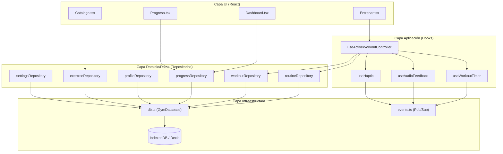
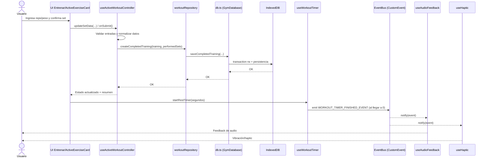
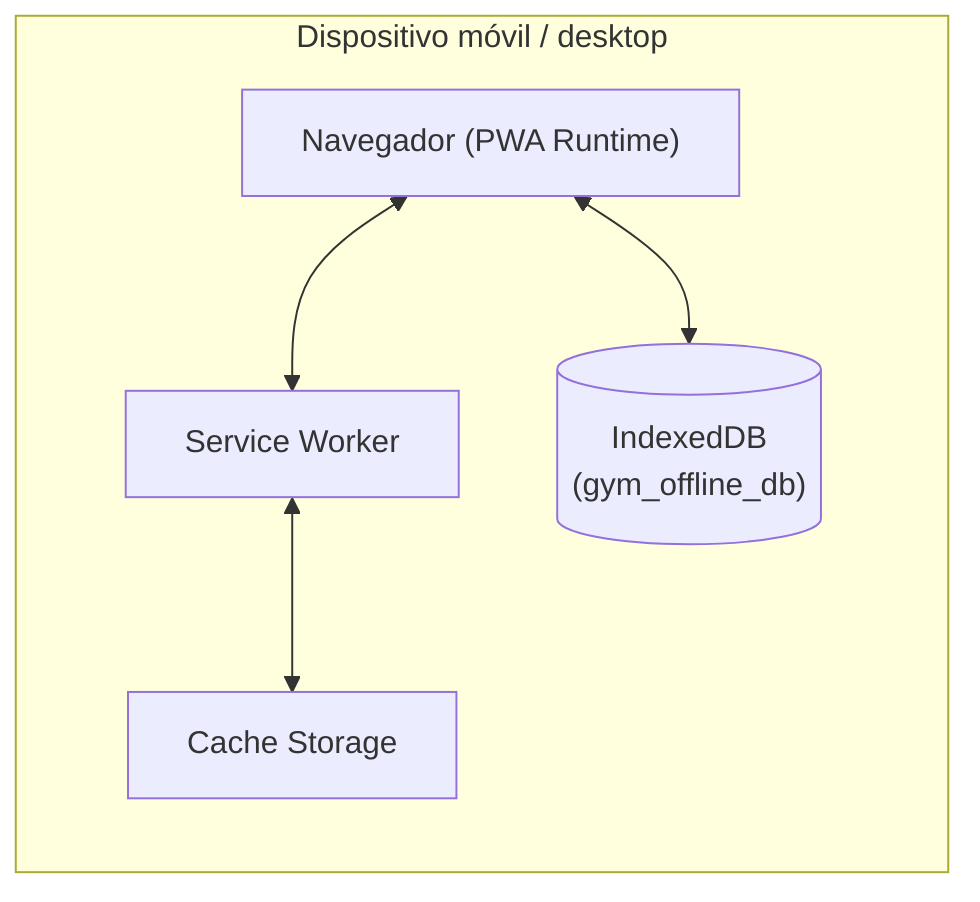

# MyHomeGym – Arquitectura de Software (4+1 Vistas)

Última actualización: 2026-02-25

## A. Introducción y Contexto

### A.1 Alcance del sistema
MyHomeGym es una PWA **offline-first** para registrar entrenamientos, gestionar rutinas, visualizar progreso y mantener historial físico/de rendimiento sin dependencia obligatoria de backend.

### A.2 Objetivos arquitectónicos
- Baja latencia percibida en operaciones de registro diario.
- Alta disponibilidad sin conexión.
- Mantenibilidad del frontend mediante separación de responsabilidades.
- Evolución segura con tipado fuerte y reglas de linting/testing.

### A.3 Stakeholders y preocupaciones
- Usuario final: rapidez, confiabilidad y privacidad de datos.
- Equipo de desarrollo: modularidad, testabilidad, bajo acoplamiento.
- Mantenimiento futuro: documentación de decisiones y trazabilidad técnica.

### A.4 Restricciones
- Frontend-only para operaciones core (persistencia local).
- Navegadores con soporte de IndexedDB.
- Stack base: React + TypeScript + Vite + Dexie.

### A.5 Trazabilidad con planificación
Esta arquitectura implementa y extiende el plan funcional definido en `docs/MASTER_PLAN.md` y la guía de entorno en `docs/SETUP_AND_DEPENDENCIES.md`.

---

## B. Vista Lógica (Estructura del código)

### B.1 Estilo arquitectónico adoptado
Se adopta un enfoque en capas para frontend:

1. **Capa UI/Presentación**: páginas y componentes React.
2. **Capa de Aplicación**: hooks de orquestación y casos de uso.
3. **Capa de Dominio/Datos**: repositorios por dominio.
4. **Capa de Infraestructura**: `db.ts` (Dexie/IndexedDB) y utilidades de plataforma.

### B.2 Convenciones de repositorio
Convención estandarizada por intención:
- Lectura: `list*`, `get*By*`.
- Escritura: `create*`, `update*`, `delete*`, `upsert*`.
- Operaciones compuestas: verbos explícitos (`reorder*`, `swap*`, `clear*`).

### B.3 Paquetes/artefactos principales
- UI: `src/pages`, `src/components`.
- Aplicación: `src/hooks` (ej. `useActiveWorkoutController`, `useWorkoutTimer`).
- Datos: `src/repositories/*Repository.ts`.
- Infraestructura: `src/lib/db.ts`, `src/lib/export.ts`, `src/lib/backup.ts`, `src/lib/events.ts`.

### B.4 Diagrama lógico (componentes/capas)

---

## C. Vista de Procesos (Comportamiento en tiempo de ejecución)

### C.1 Escenario crítico: “Usuario finaliza un set”
Objetivo: capturar una serie con validación, persistirla localmente y disparar feedback sin acoplar temporizador con audio/háptica.

### C.2 Diagrama de secuencia

### C.3 Propiedades de calidad observables
- Persistencia local atómica para operaciones compuestas.
- Reacción UI consistente mediante consultas reactivas.
- Efectos secundarios desacoplados por eventos (Observer/Pub-Sub).

---

## D. Vista de Despliegue / Física (PWA)

### D.1 Topología de despliegue
El sistema se despliega como aplicación web estática (Vite build) ejecutada dentro del navegador del dispositivo del usuario.

### D.2 Diagrama de nodos

### D.3 Consideraciones operativas
- **Sin backend obligatorio** para operaciones core.
- **Disponibilidad offline** apoyada por cache + IndexedDB.
- **Privacidad por localización de datos**: los datos permanecen en el dispositivo salvo exportación explícita del usuario.

---

## E. Registros de Decisión de Arquitectura (ADR)

### ADR-001 – PWA Local-First con Dexie
- **Estado**: Aceptada.
- **Contexto**: El sistema requiere disponibilidad sin red y respuesta inmediata en registro de entrenamientos.
- **Decisión**: Persistencia principal en IndexedDB mediante Dexie y arquitectura PWA.
- **Justificación teórica**: Optimiza requisitos no funcionales de latencia, disponibilidad y privacidad (alineado con análisis de RNF).
- **Consecuencias**:
  - Positivas: UX rápida offline, resiliencia ante conectividad inestable.
  - Negativas: complejidad de sincronización futura si se añade backend.

### ADR-002 – Arquitectura en Capas en frontend
- **Estado**: Aceptada.
- **Contexto**: Existía mezcla de UI + lógica + acceso a datos directo.
- **Decisión**: Separación en UI, aplicación (hooks), repositorios y capa de infraestructura.
- **Justificación teórica**: Incrementa cohesión y reduce acoplamiento; mejora testabilidad y mantenibilidad (estilo en capas).
- **Consecuencias**:
  - Positivas: mayor claridad de responsabilidades, cambios locales más seguros.
  - Negativas: más artefactos y sobrecarga inicial de diseño.

### ADR-003 – Observer/Pub-Sub para feedback de timer
- **Estado**: Aceptada.
- **Contexto**: El timer estaba acoplado directamente a audio/háptica.
- **Decisión**: Emisión de evento `WORKOUT_TIMER_FINISHED_EVENT` y suscripción desde hooks de feedback.
- **Justificación teórica**: El patrón publicar/suscribir desacopla productor y consumidores de eventos.
- **Consecuencias**:
  - Positivas: extensibilidad (nuevos listeners sin tocar timer), menor acoplamiento.
  - Negativas: trazabilidad de flujo más indirecta si no se documenta.

---

## Anexo – Riesgos y evolución recomendada

- Añadir pruebas unitarias por repositorio/hook para proteger contratos de capa.
- Introducir ADRs nuevos para decisiones de sincronización cloud futura.
- Mantener convención de nombres en repositorios como estándar de contribución.
